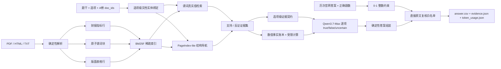

# AFAC2026 金融长文本 Agent

面向 AFAC2026 赛题四的无向量金融 RAG 系统。项目处理保险条款、监管法规、债券募集说明书、财务报告和行业研报，在 Qwen-only、禁止 embedding、严格统计在线 Token 的约束下，将官网得分从 `58.1679` 提升到 **`86.2732`**。V10 正在用 V9 官网反馈、条件化整数约束和原文残差复核继续提分，未经提交不将推断正确率写成实测成绩。

## 当前结果

| 指标 | V1 | V2 | V3 | V4 | V5 | V6 | V7 | V8 | V9 | V10 candidate |
|---|---:|---:|---:|---:|---:|---:|---:|---:|---:|---:|
| 核心方法 | 财报指标行 | 文档级穷举 | 原子谓词 | 确定性版面 | 结构导航 + 真值组装 | 证据契约 + 事实账本 | 题干范围门禁 | 显式蕴含门禁 | 官网约束 + 残差审计 | 分差反演 + 条件化约束 |
| 官网得分 | 58.1679 | 57.7848 | 66.2592 | 68.6873 | 80.4466 | 83.33 | 84.3124 | 83.3249 | **86.2732** | 待提交 |
| 反推正确题数 | 62 | 67 | 约 68 | 70 | 82 | 85 | 86 | 85 | **88** | 推断 90 |
| 在线 Token | 1,030,141 | 2,292,333 | 377,650 | 312,541 | 315,727 | 326,076 | 327,052 | 328,445 | **327,052** | 327,052 |
| 状态 | 保留 | 负向实验 | 保留 | 保留 | 保留 | 保留 | 保留 | 已证伪 | **官网基线** | **当前候选** |

V1 到 V9 的结果变化：

- 综合分 `+28.1053`。
- 正确率从 `62%` 提升到 `88%`。
- 在线 Token 从 `1,030,141` 降到 `327,052`，减少约 `68.3%`。
- V4 到 V5 只增加约 `1.0%` Token，净增 12 道正确题。

已发布快照保存在本地 `outputs/releases/`，后续诊断运行保存在各版本输出目录。V7
`answer.csv` 的 SHA-256 为：

```text
490F4A3226702CEC346919D7C432B70B913FDDF018A481226DC070ED4C7D3287
```

## 系统架构



### 关键设计

1. **结构保真的离线解析**
   - PyMuPDF 字符坐标和矢量线恢复有框/无线框表格。
   - 表名、单位、年度层级表头和跨页续表上下文绑定到每个数据行。
   - 离线预处理不调用非 Qwen 模型，不产生比赛在线 Token。

2. **无 embedding 的混合稀疏检索**
   - BM25F 同时索引正文、标题、章节、条款号、数值、日期和结构化字段。
   - 查询拆为“候选支持”和“不携带候选值的谓词真实值”，减少错误选项对召回的牵引。
   - PageIndex-lite 先定位页面/章节，再展开邻页；它只补充候选，不删除全局 BM25F 命中。

3. **选项级证据隔离**
   - 数字文档 ID 映射为真实保险产品、公司和研报主题。
   - 选项点名“太保”“平安e生保”或 `fc_text_003` 时，只在对应文档核验。
   - 证据同时保留支持与反证，防止相似产品条款交叉套用。

4. **逐项真值与保守发布**
   - Qwen 判断“该选项是否应按题干被选中”，不是只判断括号解释是否成立。
   - 多选答案由 `true` 选项确定性组装，`uncertain` 不自动入选。
   - 候选答案默认回退上一官方版本，只有带原文依据的复核配置可以改答案。

## 版本迭代

### V1：财报指标行与答案门禁

把退化财务表编译为 `metric/year/value/unit/header` 行级事实，并增加题面 SHA-1 绑定的答案级开发门禁。该版本证明结构化行比扩大普通 Top-K 更有效。

### V2：文档级穷举，保留的负向实验

每个选项遍历题目指定文档并执行反证审计，正确题数从 62 增至 67；但 Token 增至 229 万，综合分下降。结论是召回覆盖率提升不等于证据密度提升，更不等于最终得分提升。

### V3：原子谓词与保守融合

将粗粒度页面切成 38,544 个原子子块，父块只负责局部上下文恢复；支持查询与真实值查询分离。Token 相对 V2 降低约 83.5%，官网得分提升到 66.2592。

### V4：确定性 PDF 版面与表格

在 V3 旁路增加 32,663 个版面块，其中 14,302 个结构化表格行。它不替换原文本，避免解析器单点失败。官网得分提升到 68.6873。

### V5：结构导航、文档绑定与逐项真值

增加 PageIndex-lite、产品/公司实体别名、选项级文档范围和程序化真值组装。54 个模型候选变化中仅接受 14 个直接证据闭环，官网验证净增 12 题，达到 **80.4466**。

### V6：证据充分性、口径和跨题一致性

- 对每个选项记录必需文档、谓词、数值端点、覆盖率、冲突和风险，不完整时返回 `uncertain`。
- 财报事实账本显式区分合并/母公司、全年/季度、公司总额/客户或分部口径，并用受限 DSL 做比较。
- 新增近重复事实图，只把同一源文档中的同口径断言送入人工复核，不自动投票改答案。
- 对 100 题 V6 候选的 41 个变化和 59 个未变化题均完成离线/在线审计；默认只接受 6 个直接原文闭环。
- 正式提交为 `326,076` Token，官网得分 `83.33`，按评分公式对应 `85/100`；六处变化相对 V5 净增 3 题。

详细设计、失败案例和 probe 说明见 [docs/V6_EVIDENCE_CONTRACT.md](docs/V6_EVIDENCE_CONTRACT.md)。

### V7：题干范围门禁与分数诊断

- 将 `fact_truth` 与 `applicable` 分开，只在“哪些情形需要审批”“哪些产品可以赔付”等显式集合题启用。
- 全题开启的首轮实验产生 42 题漂移和 `485,509` Token，已判定为负向实验。
- 收缩后仅 6 道范围题触发门禁，6/6 均稳定复现 V6 答案；普通事实题继续使用 V6 协议。
- 按官网公式自动反推正确题数，并生成方法级消融矩阵。
- `reg_a_003: B -> A` 获官网验证，`327,052` Token 对应 `86/100` 和 `84.3124` 分。

### V8：显式蕴含门禁，已证伪

- 否定、缺失和“不涵盖”类选项必须有直接条款，不能仅由产品类型或文档未提及推出。
- 唯一修改 `ins_a_008: ABC -> AC`，官网从 86 题正确降为 85 题，证明该选项应保留为 `ABC`。
- 结论：模型一致和“文档未提及”均不能替代标准答案；显式蕴含门禁只用于审计，不直接覆盖基线。

### V9：官网整数约束与残差复核

- 将历次官网正确题数写成 0-1 整数约束，先排除不可能答案；约束证明 `fc_a_014=B` 必错。
- 修复判断题字面扫描使用“正确/错误”而非题干命题的召回缺陷，并过滤空锚点误命中。
- `target90` 相对 V7 共 6 处变化，官网 `86.2732`，对应 `88/100`。
- 六题净增 2，若真实标签只取新旧答案，则恰有 4 个增益、2 个回归。
- 联合可行只能排除数学矛盾，不能证明候选答案正确。

### V10 candidate：条件化分差反演

- 枚举 V9 的四增二减模式，并以原文和 V2→V7 连续净变化方程排序。
- 保留 `fc_a_014`、`reg_a_004`、`res_a_003`、`res_a_011`，撤销 V9 的
  `fc_a_012`、`fc_a_015`。
- 固定四个标签后，历史方程额外强制保护 24 道当前答案，共 28 道必对题。
- 深证据全量实验使用 `783,244` Token 产生 25 个反转，其中多项与强制正确答案冲突，
  证明扩大上下文不能作为自动覆盖规则。
- V10 若分差模式判断正确则为 `90/100`、理论综合分 `88.233919`，当前仍待官网验证。

完整版本记录见 [VERSION_SCORE_LOG.md](VERSION_SCORE_LOG.md)，简历与面试表述见 [docs/RESUME_CASE_STUDY.md](docs/RESUME_CASE_STUDY.md)。

## 技术取舍

| 方向 | 是否采用 | 原因 |
|---|---|---|
| BM25F + 字符/词粒度 tokenizer | 是 | 合规、可解释；对中文条款号、数值和专名稳定 |
| PageIndex-lite | 是 | 利用长文档自然结构，不依赖 embedding；作为增量旁路可控制回归 |
| SURE-RAG 式充分性聚合 | 部分采用 | 迁移 coverage/conflict/uncertainty 思想，以确定性证据契约实现 |
| H-STAR 式表格混合推理 | 部分采用 | 先恢复列/行和口径，再由受限 DSL 执行数值比较 |
| ChainRAG/FunnelRAG 式渐进检索 | 部分采用 | 只在缺失谓词或数值端点时补检索，不启用无限多轮 Agent |
| 官网总分 0-1 整数约束 | 是 | 用完整提交和整数正确题数排除不可能标签，并执行联合可行性门禁 |
| GraphRAG / LightRAG | 否 | A 榜已有候选 `doc_ids`，问题多为局部条款和表格事实；全局图构建成本高且收益不确定 |
| 全题 LogicRAG / PoT / LLM Judge | 否 | 实验中产生 52 题答案漂移，Token 从 31 万增至 63 万 |
| 全题 30K 深证据上下文 | 否 | 783,244 Token 产生 25 个反转，多项违反官网强制正确约束 |
| 全量 OCR / VLM | 否 | 主要 PDF 有文字层；确定性坐标解析更便于复现，旧视觉候选官网净损失 |
| embedding / 向量数据库 | 否 | 赛题明确禁止 |
| 非 Qwen reranker 或小模型 | 否 | 赛题限制在线模型为 Qwen 系列 |
| 微调 / LoRA | 否 | 赛题禁止修改基座模型参数 |

## 仓库结构

```text
agent/
  data/          # 题目、文档注册和业务别名
  preprocess/    # 解析、原子分块、版面表格
  index/         # BM25/BM25F 稀疏索引
  retrieve/      # 谓词查询、证据选择、结构导航
  reasoning/     # 精确验证、计算和答案组装
  evaluation/    # 开发门禁与保守融合
  llm/           # 百炼 OpenAI-compatible Qwen client
  io/            # JSONL、提交文件和 Token 汇总
scripts/         # 01-34 可复现流水线
configs/         # V3-V10 分层复核配置
devsets/         # 带题面指纹的开发集
tests/           # 单元与集成回归
theory/          # 论文调研和各版本技术笔记
```

## 环境

- Windows PowerShell
- Python 3.10+
- 阿里云百炼 `qwen3.7-plus` 或 `qwen3.7-max`

```powershell
python -m venv .venv
.\.venv\Scripts\Activate.ps1
pip install -r requirements.txt
Copy-Item .env.example .env
```

在 `.env` 中设置：

```text
DASHSCOPE_API_KEY=your_key
AFAC_QWEN_MODEL=qwen3.7-max
```

`.env`、`agent/local_settings.py`、`processed_data/` 和 `outputs/` 均被 Git 忽略。

## 复现 V5

### 1. 构建 V3 原子索引

```powershell
python scripts\15_build_hierarchical_index.py
```

### 2. 构建 V4 版面索引

```powershell
python scripts\19_build_layout_index.py --strict
```

### 3. 运行 V5

```powershell
python scripts\16_run_precise_verifier.py `
  --index processed_data\v4_layout\bm25_index.pkl `
  --output-dir outputs\v5_candidate `
  --model qwen3.7-max `
  --workers 8 `
  --no-thinking `
  --structure-navigation `
  --assemble-from-checks `
  --strategy-name v5_structure
```

### 4. 与 V4 官方基线保守融合

```powershell
python scripts\21_merge_structure_candidate.py `
  --baseline outputs\v4_layout_final\answer_results.jsonl `
  --candidate outputs\v5_candidate\answer_results.jsonl `
  --reviews configs\v5_structure_reviews.json `
  --output outputs\v5_structure_final\answer_results.jsonl
```

仓库当前本地复现使用已经完成的分域候选：

```powershell
python scripts\21_merge_structure_candidate.py `
  --baseline outputs\v4_layout_final\answer_results.jsonl `
  --candidate outputs\v5_structure_insurance\answer_results.jsonl outputs\v5_structure_remaining\answer_results.jsonl `
  --reviews configs\v5_structure_reviews.json `
  --output outputs\v5_structure_final\answer_results.jsonl
```

### 5. 生成提交并执行硬门禁

```powershell
python scripts\09_eval_answer_devset.py `
  --results outputs\v5_structure_final\answer_results.jsonl `
  --strict

python scripts\04_make_submission.py `
  --results outputs\v5_structure_final\answer_results.jsonl `
  --output-dir outputs\releases\v5 `
  --require-complete

python -m pytest -q
```

## 复现 V6

```powershell
python scripts\16_run_precise_verifier.py `
  --index processed_data\v3_atomic\bm25_index.pkl `
  --output-dir outputs\v6_full_candidate `
  --model qwen3.7-max `
  --structure-navigation `
  --assemble-from-checks `
  --evidence-contract `
  --numeric-verifier `
  --strategy-name v6_evidence_contract

python scripts\23_merge_v6_candidate.py `
  --output outputs\v6_evidence_final\answer_results.jsonl

python scripts\04_make_submission.py `
  --results outputs\v6_evidence_final\answer_results.jsonl `
  --require-complete
```

默认命令不会纳入 `configs/v6_evidence_reviews.json` 中的 probe。单变量榜单诊断必须显式使用 `--include-probe`。

## 生成 V7 单变量候选

```powershell
python scripts\26_merge_v7_targeted_candidate.py `
  --include-group reg3_terminal_storage `
  --output outputs\v7_probe_reg3\answer_results.jsonl

python scripts\04_make_submission.py `
  --results outputs\v7_probe_reg3\answer_results.jsonl `
  --output-dir outputs\v7_probe_reg3 `
  --require-complete
```

`fc15_single_choice_collision` 只用于确认双真单选题的官方处理，不建议与
`reg3_terminal_storage` 首次合并提交。候选说明见 [docs/V7_QUESTION_ENVELOPE.md](docs/V7_QUESTION_ENVELOPE.md)。

## 复现 V8 负向实验

```powershell
python scripts\27_merge_v8_candidate.py `
  --include-group ins8_explicit_coverage `
  --output outputs\v8_ins8_candidate\answer_results.jsonl

python scripts\04_make_submission.py `
  --results outputs\v8_ins8_candidate\answer_results.jsonl `
  --output-dir outputs\v8_ins8_candidate `
  --require-complete
```

唯一变化是 `ins_a_008: ABC -> AC`。该提交官网为 `83.3249`、85/100，
低于 V7，不应再次提交。复盘见 [docs/V8_EXPLICIT_ENTAILMENT.md](docs/V8_EXPLICIT_ENTAILMENT.md)。

V8 同时提供选项级多运行共识审计：

```powershell
python scripts\28_audit_option_consensus.py `
  --baseline outputs\releases\v7\answer_results.jsonl `
  --candidate outputs\v6_full_candidate\answer_results.jsonl `
  --candidate outputs\v6_exhaustive_audit\answer_results.jsonl `
  --candidate outputs\v6_remaining_exhaustive\answer_results.jsonl `
  --candidate outputs\v6_unchanged_exhaustive\answer_results.jsonl `
  --min-runs 2 `
  --output outputs\v8_option_consensus.json
```

该报告只列出待复核候选，不自动修改答案。现有九个一致翻转中，八个已被直接原文否决；
当时只保留 `ins_a_008` 进入首个单变量提交；官网结果已证明该共识翻转错误。

## 生成 V10 候选

```powershell
python scripts\31_build_residual_candidate.py `
  --config configs\v10_inferred_reviews.json `
  --profile inferred90 `
  --output outputs\v10_inferred90\answer_results.jsonl

python scripts\04_make_submission.py `
  --results outputs\v10_inferred90\answer_results.jsonl `
  --output-dir outputs\v10_inferred90 `
  --require-complete
```

下一份保守提交为 `outputs/v10_inferred90/answer.csv`，SHA-256：

```text
4DD820F71F868866E224A79CC5901E9165EF2919BF1CB04D83065D3D7D92A8B0
```

V9 反馈和 V10 分差反演见
[docs/V9_CONSTRAINED_RESIDUALS.md](docs/V9_CONSTRAINED_RESIDUALS.md)、
[docs/V10_CONDITIONED_CONSTRAINTS.md](docs/V10_CONDITIONED_CONSTRAINTS.md)。

## 协作约定

- GitHub 只保留 `main`，功能开发使用短生命周期本地分支，合并后删除。
- 不提交 API Key、原始比赛数据、大型索引和运行输出。
- 每次修改检索或压缩策略必须记录答案差异、Token 差异和直接证据。
- 未经官网验证的结果只能称为 candidate，不写成官方准确率。

## 下一目标：先 90，再 95

当前约 33 万 Token 下，综合分达到 90 至少需要 `92/100`，达到 95 至少需要
`97/100`。先验证 V10 的推断 `90/100` 基线，再从剩余未决题中获得至少 2 个
直接原文纠错。跨模型、B 榜无 `doc_ids`、embedding 和跨语料重构记录在
[核心开发计划](docs/CORE_DEVELOPMENT_PLAN.md)，达到当前赛题门槛后实施。
