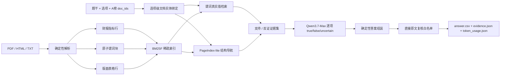

# AFAC2026 金融长文本 Agent

面向 AFAC2026 赛题四的无向量金融 RAG 系统。项目处理保险条款、监管法规、债券募集说明书、财务报告和行业研报，在 Qwen-only、禁止 embedding、严格统计在线 Token 的约束下，将官网得分从 `58.1679` 提升到 **`80.4466`**。

## 当前结果

| 指标 | V1 | V2 | V3 | V4 | V5 |
|---|---:|---:|---:|---:|---:|
| 核心方法 | 财报指标行 | 文档级穷举 | 原子谓词 | 确定性版面 | 结构导航 + 真值组装 |
| 官网得分 | 58.1679 | 57.7848 | 66.2592 | 68.6873 | **80.4466** |
| 反推正确题数 | 62 | 67 | 约 68 | 70 | **82** |
| 在线 Token | 1,030,141 | 2,292,333 | 377,650 | 312,541 | **315,727** |
| 状态 | 保留 | 负向实验 | 保留 | 保留 | **当前主线** |

V1 到 V5 的结果变化：

- 综合分 `+22.2787`。
- 正确率从 `62%` 提升到 `82%`。
- 在线 Token 从 `1,030,141` 降到 `315,727`，减少约 `69.3%`。
- V4 到 V5 只增加约 `1.0%` Token，净增 12 道正确题。

官方提交文件保存在本地 `outputs/releases/v1..v5/`。V5 `answer.csv` 的 SHA-256 为：

```text
1E6B16AF94F5CF0908899E7CB1A7A3844794708E43EBEC2627EC5A2CB1F6D2EA
```

## 系统架构



### 关键设计

1. **结构保真的离线解析**
   - PyMuPDF 字符坐标和矢量线恢复有框/无线框表格。
   - 表名、单位、年度层级表头和跨页续表上下文绑定到每个数据行。
   - 离线预处理不调用非 Qwen 模型，不产生比赛在线 Token。

2. **无 embedding 的混合稀疏检索**
   - BM25F 同时索引正文、标题、章节、条款号、数值、日期和结构化字段。
   - 查询拆为“候选支持”和“不携带候选值的谓词真实值”，减少错误选项对召回的牵引。
   - PageIndex-lite 先定位页面/章节，再展开邻页；它只补充候选，不删除全局 BM25F 命中。

3. **选项级证据隔离**
   - 数字文档 ID 映射为真实保险产品、公司和研报主题。
   - 选项点名“太保”“平安e生保”或 `fc_text_003` 时，只在对应文档核验。
   - 证据同时保留支持与反证，防止相似产品条款交叉套用。

4. **逐项真值与保守发布**
   - Qwen 判断“该选项是否应按题干被选中”，不是只判断括号解释是否成立。
   - 多选答案由 `true` 选项确定性组装，`uncertain` 不自动入选。
   - 候选答案默认回退上一官方版本，只有带原文依据的复核配置可以改答案。

## 五版迭代

### V1：财报指标行与答案门禁

把退化财务表编译为 `metric/year/value/unit/header` 行级事实，并增加题面 SHA-1 绑定的答案级开发门禁。该版本证明结构化行比扩大普通 Top-K 更有效。

### V2：文档级穷举，保留的负向实验

每个选项遍历题目指定文档并执行反证审计，正确题数从 62 增至 67；但 Token 增至 229 万，综合分下降。结论是召回覆盖率提升不等于证据密度提升，更不等于最终得分提升。

### V3：原子谓词与保守融合

将粗粒度页面切成 38,544 个原子子块，父块只负责局部上下文恢复；支持查询与真实值查询分离。Token 相对 V2 降低约 83.5%，官网得分提升到 66.2592。

### V4：确定性 PDF 版面与表格

在 V3 旁路增加 32,663 个版面块，其中 14,302 个结构化表格行。它不替换原文本，避免解析器单点失败。官网得分提升到 68.6873。

### V5：结构导航、文档绑定与逐项真值

增加 PageIndex-lite、产品/公司实体别名、选项级文档范围和程序化真值组装。54 个模型候选变化中仅接受 14 个直接证据闭环，官网验证净增 12 题，达到 **80.4466**。

完整版本记录见 [VERSION_SCORE_LOG.md](VERSION_SCORE_LOG.md)，简历与面试表述见 [docs/RESUME_CASE_STUDY.md](docs/RESUME_CASE_STUDY.md)。

## 技术取舍

| 方向 | 是否采用 | 原因 |
|---|---|---|
| BM25F + 字符/词粒度 tokenizer | 是 | 合规、可解释；对中文条款号、数值和专名稳定 |
| PageIndex-lite | 是 | 利用长文档自然结构，不依赖 embedding；作为增量旁路可控制回归 |
| GraphRAG / LightRAG | 否 | A 榜已有候选 `doc_ids`，问题多为局部条款和表格事实；全局图构建成本高且收益不确定 |
| 全题 LogicRAG / PoT / LLM Judge | 否 | 实验中产生 52 题答案漂移，Token 从 31 万增至 63 万 |
| 全量 OCR / VLM | 否 | 主要 PDF 有文字层；确定性坐标解析更便于复现，旧视觉候选官网净损失 |
| embedding / 向量数据库 | 否 | 赛题明确禁止 |
| 非 Qwen reranker 或小模型 | 否 | 赛题限制在线模型为 Qwen 系列 |
| 微调 / LoRA | 否 | 赛题禁止修改基座模型参数 |

## 仓库结构

```text
agent/
  data/          # 题目、文档注册和业务别名
  preprocess/    # 解析、原子分块、版面表格
  index/         # BM25/BM25F 稀疏索引
  retrieve/      # 谓词查询、证据选择、结构导航
  reasoning/     # 精确验证、计算和答案组装
  evaluation/    # 开发门禁与保守融合
  llm/           # 百炼 OpenAI-compatible Qwen client
  io/            # JSONL、提交文件和 Token 汇总
scripts/         # 01-21 可复现流水线
configs/         # V3/V4/V5 人工复核配置
devsets/         # 带题面指纹的开发集
tests/           # 单元与集成回归
theory/          # 论文调研和各版本技术笔记
```

## 环境

- Windows PowerShell
- Python 3.10+
- 阿里云百炼 `qwen3.7-plus` 或 `qwen3.7-max`

```powershell
python -m venv .venv
.\.venv\Scripts\Activate.ps1
pip install -r requirements.txt
Copy-Item .env.example .env
```

在 `.env` 中设置：

```text
DASHSCOPE_API_KEY=your_key
AFAC_QWEN_MODEL=qwen3.7-max
```

`.env`、`agent/local_settings.py`、`processed_data/` 和 `outputs/` 均被 Git 忽略。

## 复现 V5

### 1. 构建 V3 原子索引

```powershell
python scripts\15_build_hierarchical_index.py
```

### 2. 构建 V4 版面索引

```powershell
python scripts\19_build_layout_index.py --strict
```

### 3. 运行 V5

```powershell
python scripts\16_run_precise_verifier.py `
  --index processed_data\v4_layout\bm25_index.pkl `
  --output-dir outputs\v5_candidate `
  --model qwen3.7-max `
  --workers 8 `
  --no-thinking `
  --structure-navigation `
  --assemble-from-checks `
  --strategy-name v5_structure
```

### 4. 与 V4 官方基线保守融合

```powershell
python scripts\21_merge_structure_candidate.py `
  --baseline outputs\v4_layout_final\answer_results.jsonl `
  --candidate outputs\v5_candidate\answer_results.jsonl `
  --reviews configs\v5_structure_reviews.json `
  --output outputs\v5_structure_final\answer_results.jsonl
```

仓库当前本地复现使用已经完成的分域候选：

```powershell
python scripts\21_merge_structure_candidate.py `
  --baseline outputs\v4_layout_final\answer_results.jsonl `
  --candidate outputs\v5_structure_insurance\answer_results.jsonl outputs\v5_structure_remaining\answer_results.jsonl `
  --reviews configs\v5_structure_reviews.json `
  --output outputs\v5_structure_final\answer_results.jsonl
```

### 5. 生成提交并执行硬门禁

```powershell
python scripts\09_eval_answer_devset.py `
  --results outputs\v5_structure_final\answer_results.jsonl `
  --strict

python scripts\04_make_submission.py `
  --results outputs\v5_structure_final\answer_results.jsonl `
  --output-dir outputs\releases\v5 `
  --require-complete

python -m pytest -q
```

## 协作约定

- GitHub 只保留 `main`，功能开发使用短生命周期本地分支，合并后删除。
- 不提交 API Key、原始比赛数据、大型索引和运行输出。
- 每次修改检索或压缩策略必须记录答案差异、Token 差异和直接证据。
- 未经官网验证的结果只能称为 candidate，不写成官方准确率。

## 下一目标：90 分

在 V5 的 `315,727` Token 下，至少需要 `92/100` 正确，预计综合分约 `90.2572`。这意味着相对 V5 再净增 10 题。下一阶段以证据覆盖门禁、保险/合同计算器、表格 schema 对齐和全称/否定断言验证为主，不再使用全题 Judge 扩大答案漂移。
